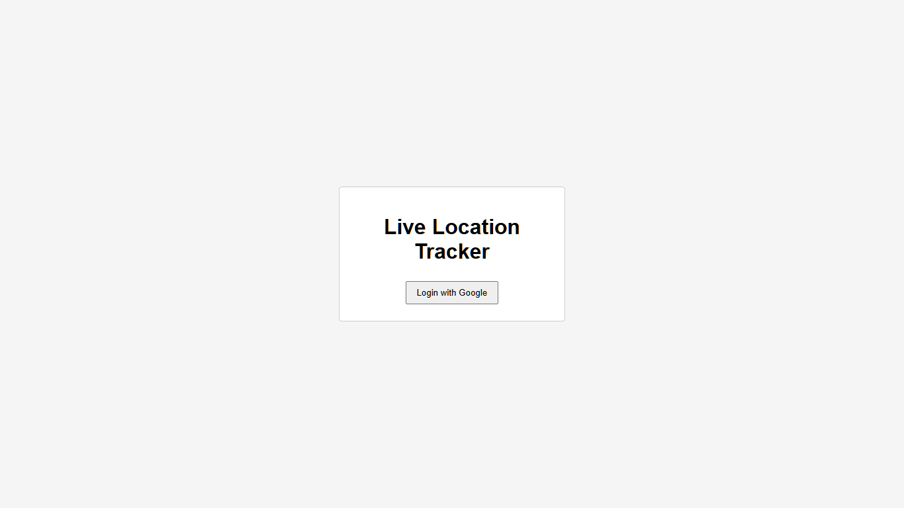
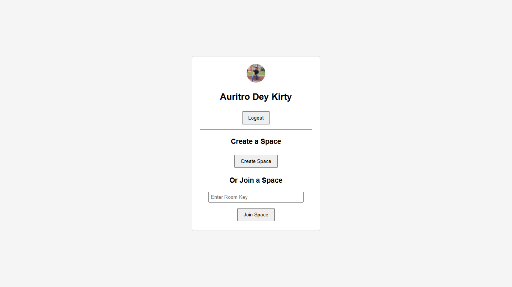
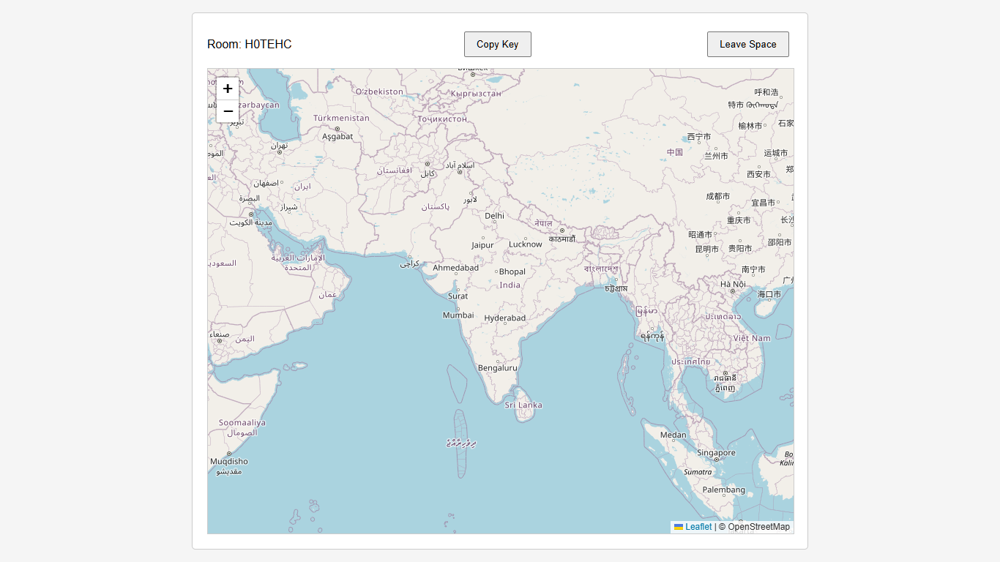

<div align="center">

# Live Web Tracker

### Real-time Location Sharing with Google Authentication & Interactive Maps

<p>
A modern web application that allows users to securely share their live location inside private rooms using Firebase Authentication, Firestore, Leaflet Maps, and the Geolocation API.
</p>

<br>


</div>

---

# Overview

Live Web Tracker is a room-based real-time location sharing platform where users authenticate using Google, create or join private spaces, and instantly view each other's live location on an interactive map.

The project demonstrates real-world concepts including authentication, real-time databases, browser geolocation, reverse geocoding, and collaborative applications.

---

# Features

Google Authentication

Create private tracking spaces

Join existing rooms via room code

Live location updates

Interactive Leaflet map

Real-time synchronization using Firestore

Reverse geocoding (Coordinates → Address)

Automatic room cleanup

Copy room key

Responsive UI

---

# Screenshots

| Login | Dashboard |
|--------|-----------|
|  |  |

| Map View | User Popup |
|-----------|------------|
|  |  |

---

# Tech Stack

## Frontend

- HTML5
- CSS3
- JavaScript (ES6)

## Authentication

- Firebase Authentication
- Google OAuth

## Backend

- Firebase Firestore

## Maps

- Leaflet.js
- OpenStreetMap

## APIs

- Geolocation API
- Geoapify Reverse Geocoding API

---

# How It Works

1. User signs in using Google.
2. Create a new room or join an existing room.
3. Browser requests location permission.
4. Live coordinates are uploaded to Firestore.
5. Firestore synchronizes every connected user.
6. Leaflet updates markers instantly.
7. Reverse Geocoding converts coordinates into readable addresses.
8. When a user leaves, their marker is removed automatically.
9. Empty rooms are deleted from Firestore.

---

# Project Structure

```
Live-Web-Tracker
│
├── index.html
├── style.css
├── script.js
│
├── assets/
│   ├── login.png
│   ├── dashboard.png
│   ├── map.png
│   └── popup.png
│
└── README.md
```

---

# Getting Started

## Clone Repository

```bash
git clone https://github.com/AuritroDeyKirty07/live-web-tracker-app.git
```

## Live Link

```
https://live-web-tracker-app.vercel.app/
```

---

# Future Improvements

- Friend Invitations
- Live Chat
- Route Tracking
- Travel History
- Distance Between Members
- ETA Calculation
- Custom Map Themes
- Mobile PWA Support

---

# Concepts Demonstrated

- Firebase Authentication
- Firestore Realtime Database
- Google OAuth
- Browser Geolocation
- Reverse Geocoding
- Leaflet Maps
- Realtime Collaboration
- CRUD Operations
- DOM Manipulation
- Async JavaScript

---

# Author

**Auritro Dey Kirty**

Full Stack Developer

[Portfolio](https://auritrodeykirty07.github.io/Portfolio/) •
[GitHub](https://github.com/AuritroDeyKirty07)

---

<div align="center">

If you found this project interesting, consider ⭐ the repository!

</div>
