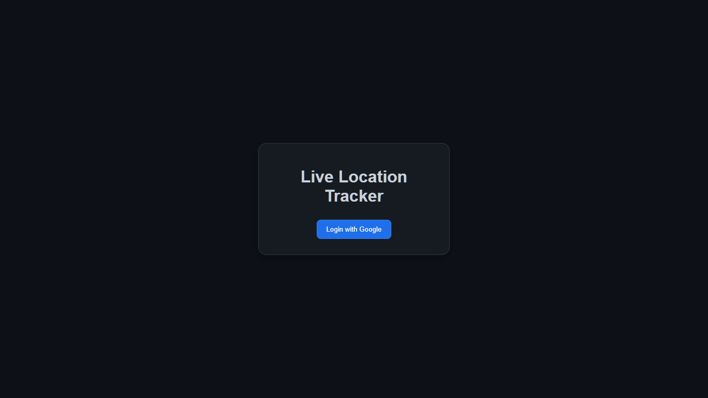
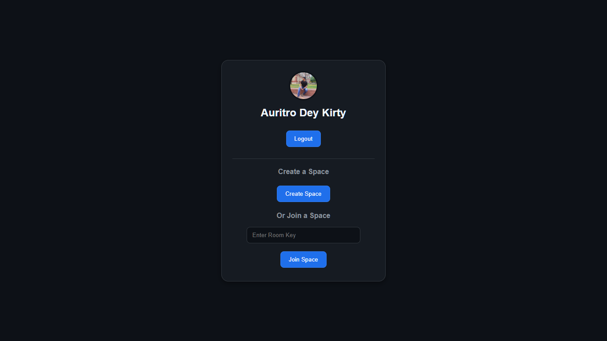
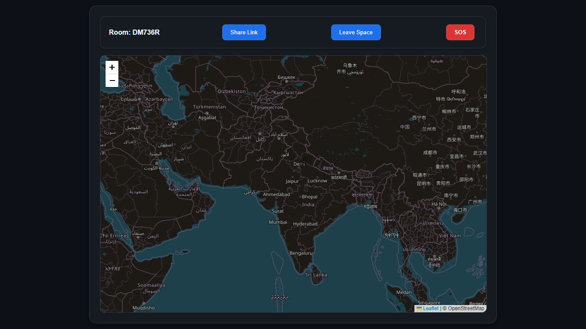
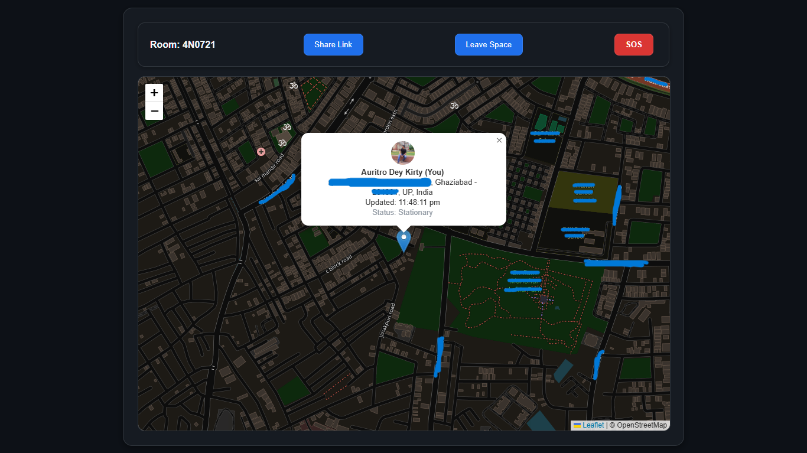

<div align="center">

# Live Web Tracker

### Real-time Location Sharing with Google Authentication & Interactive Maps

<p>
Live Web Tracker is a modern web application that allows you and your friends to securely share live locations inside private rooms. It uses Firebase Authentication, Firestore, Leaflet Maps, and the Geolocation API to create a seamless tracking experience.
</p>

<br>


</div>

<hr>

# Overview

Live Web Tracker is a room based real-time location sharing platform. You can authenticate using your Google account, create private spaces, or join existing ones. Once inside, you can instantly view each other's live location on a sleek interactive map.

This project was built to demonstrate real-world engineering concepts like secure authentication, real-time database synchronization, browser geolocation, reverse geocoding, and collaborative application design.

<hr>

# Features

We have packed this application with powerful features to make location tracking effortless and secure.

1. Secure Google Authentication
2. Private tracking spaces that you can create or join via a unique room key
3. Real-time location and speed updates mapped instantly
4. An interactive dark mode Leaflet map
5. Distance calculation between members
6. Built-in SOS emergency alerts
7. Shareable room invite links
8. Real-time synchronization using Cloud Firestore
9. Reverse geocoding to convert coordinates into readable street addresses
10. Automatic room cleanup after inactivity
11. A responsive and eye-soothing user interface

<hr>

# Screenshots

<p>Login and Dashboard</p>



<p>Map View and User Popup</p>



<hr>

# Tech Stack

The application relies on a modern frontend stack consisting of HTML5, CSS3, and modern JavaScript. 

For backend services and authentication, we use Firebase Authentication with Google OAuth and Firebase Firestore for real-time data synchronization. 

Mapping and geolocation are powered by Leaflet.js, OpenStreetMap, the native Browser Geolocation API, and the Geoapify Reverse Geocoding API.

<hr>

# How It Works

1. You start by signing in using your Google account.
2. You can either create a new tracking room or join an existing one using a room key or a shareable link.
3. Your browser will request location permissions to track your movement.
4. Your live coordinates and speed are uploaded securely to Firestore.
5. Firestore automatically synchronizes this data with every other connected user in your room.
6. Leaflet updates all markers instantly on the map.
7. Reverse Geocoding converts raw coordinates into human-readable addresses.
8. If you close the app or leave the room, your marker is removed automatically.
9. Empty rooms are automatically garbage collected and deleted from Firestore after a period of inactivity.

<hr>

# Project Structure

```text
live-web-tracker-app
│
├── assets
│   ├── dashboard.PNG
│   ├── icons8-location-pin-32.png
│   ├── login.PNG
│   ├── map.PNG
│   └── popup.PNG
│
├── src
│   ├── utils
│   │   └── firebase.js
│   └── controllers
│       └── functionality.js
│
├── index.html
├── style.css
├── script.js
└── README.md
```

<hr>

# Getting Started

To run this project locally, simply clone the repository and open the index HTML file.

```bash
git clone https://github.com/AuritroDeyKirty07/live-web-tracker-app.git
```

If you prefer to try it out immediately without downloading, you can visit the live demo link provided below.

<p align="center">
<a href="https://live-web-tracker-app.vercel.app">

</a>
<a href="https://github.com/AuritroDeyKirty07/live-web-tracker-app">

</a>
</p>

<hr>

# Future Improvements

We have a lot of exciting ideas planned for future updates. These include Live Route Tracking to draw snail trails behind moving users, Geofencing to set safe zone boundaries, Meet in the Middle tools for finding a central gathering point, and an in-map Live Chat system.

<hr>

# Author

Auritro Dey Kirty
Full Stack Developer

You can view my portfolio or visit my GitHub profile for more projects like this.

<hr>

<div align="center">

### ⭐ If you found this project useful, consider starring the repository.

Made with ❤️ by Auritro Dey Kirty

</div>
